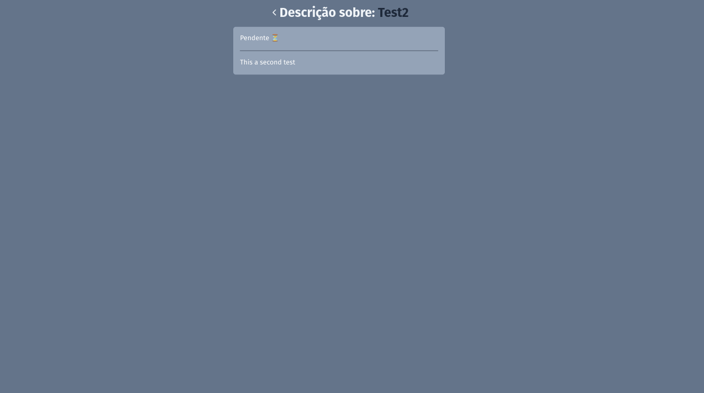

# Gerenciador de Tarefas

Este é um simples gerenciador de tarefas feito com React baseado neste [tutorial](https://www.youtube.com/watch?v=2RWsLmu8yVc&t=6726s). Ele permite adicionar, marcar como concluídas e excluir tarefas. As tarefas são salvas no `localStorage` para que permaneçam entre recarregamentos da página.

<p align=center style="display: flex;">


</p>

## Como Rodar o Projeto

### 1. Clonar o Repositório

```sh
git clone https://github.com/nando3d3/todo_list-react.git
cd todo_list-react
```

### 2. Instalar as Dependências

```sh
npm install
```

### 3. Rodar o Projeto

```sh
npm start
```

Isso iniciará o servidor de desenvolvimento e o projeto estará acessível em `http://localhost:3000/`.

## Funcionalidades

- **Adicionar tarefas**: Permite adicionar uma nova tarefa com título e descrição.
- **Marcar tarefas como concluídas**: Clicar em uma tarefa alterna seu estado de concluída/não concluída.
- **Excluir tarefas**: Remove a tarefa da lista.
- **Persistência**: As tarefas são salvas no `localStorage`.
